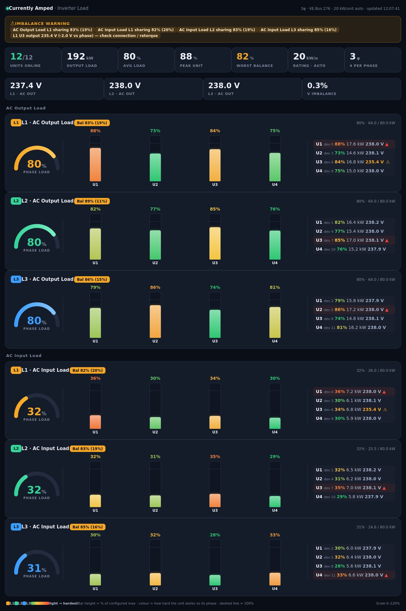

# Victron Parallel Imbalance Dashboard

**One Node-RED import for live inverter load, parallel balance, and load history.**

A phase total can hide an inverter that is working much harder than its neighbours. This dashboard shows each parallel VE.Bus inverter/charger's AC input and output power, grouped by phase, to help with commissioning and troubleshooting. Warren's current version combines the per-unit histogram bars with 60-minute time-series graphs, voltage readings, and imbalance alerts.



*Inverter Load view from a 12-unit, three-phase example. Unit count and likely phase layout are discovered from MQTT data.*

## One import, three views

Import [`victron-parallel-imbalance.json`](./victron-parallel-imbalance.json) once. It contains all three pages:

| Page | Path | What it shows |
| --- | --- | --- |
| **Inverter Load %** | `/dashboard/load` | Per-unit AC input and output histograms, phase load gauges, load-sharing balance, available AC output voltages, and an alert banner. |
| **Parallel Balance** | `/dashboard/pb` | Individual power readings and balance figures grouped by phase. |
| **Load History** | `/dashboard/page2` | Rolling 60-minute time-series graphs of each unit's AC input and output power. |

The same import supplies the load bars and the time-series graphs; no second flow is needed.

## Install or update

You need Node-RED with **FlowFuse Dashboard 2.0** and access to the installation's Victron MQTT power topics.

1. In Node-RED, choose **Menu → Import** and select [`victron-parallel-imbalance.json`](./victron-parallel-imbalance.json). If updating an older import, review the matching nodes that Node-RED offers to replace.
2. Check the imported MQTT broker. It defaults to `localhost:1883`; change it if your broker runs elsewhere.
3. In the **Parallel Balance** flow, edit **All unit AC power**. Its imported topic is fixed to VE.Bus instance `276`: `N/+/vebus/276/Devices/+/Ac/+/P`. Change the instance for your system, or use `N/+/vebus/+/Devices/+/Ac/+/P`. The Inverter Load flow already uses the wildcard.
4. Set `RATED_W_PER_UNIT` in **Build load % bars** to the continuous output rating of one inverter, in watts. Use `RATED_W_OVERRIDES` if ratings differ. The default `0` estimates a rating from observed peaks, so percentages may be wrong until enough load has been seen. **Load History** has its own `RATED_W_PER_UNIT` setting for graph scaling.
5. **Deploy** and open the pages listed above. The imported dashboard base path is `/dashboard`.

The combined flow uses these MQTT topic families:

```text
N/+/vebus/+/Devices/+/Ac/+/P    per-unit AC input and output power
N/+/vebus/+/Ac/Out/+/V          phase AC output voltage
N/+/vebus/+/Devices/+/Ac/+/V    per-unit AC output voltage, when published
```

If per-unit voltage is unavailable, the display can fall back to the phase voltage. A per-unit voltage-deviation alert needs real per-unit readings; a shared phase value cannot reveal differences between units.

## Reading the display

Histogram bar height is each unit's power as a percentage of its configured or estimated rating. Colour shows how hard a unit is working relative to others on its phase. The balance figure compares the least-loaded and most-loaded units; a lower figure means less even sharing. Load History lets you see whether that difference persists over time.

The alert banner highlights uneven sharing, phase-voltage imbalance, and per-unit voltage deviation. Thresholds are near the top of the **Build load % bars** function node in Node-RED. An alert is a prompt to investigate, **not proof of a wiring or inverter fault**. Compare readings under a meaningful load and follow safe electrical inspection practice before changing connections.

The MQTT power topics do not identify each device's phase. Automatic detection assumes contiguous, interleaved VE.Bus device numbers starting at zero. A single-phase installation with 3, 6, 9, or more units can look three-phase to this detector. If the layout is wrong, set `AUTO_PHASE_MODE` to `"single"` or `"three"` in the relevant function nodes.

## Files

| File | Purpose |
| --- | --- |
| [`victron-parallel-imbalance.json`](./victron-parallel-imbalance.json) | The complete Node-RED import, including histograms and 60-minute time-series graphs. |
| [`screenshot.jpg`](./screenshot.jpg) | Example Inverter Load view shown above. |
| [`README.md`](./README.md) | Features, setup, and reading guide. |
| [`CHANGELOG.md`](./CHANGELOG.md) | Human-readable version history. |

Original parallel imbalance flow by Frank and Warwick; dashboard extension and dark theme by Currently Amped.
