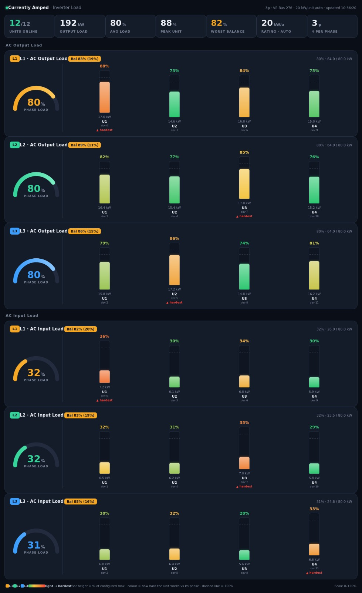

# Victron Parallel Imbalance Dashboard

**See how the work is shared between parallel VE.Bus inverter/chargers.**

Victron's phase total can hide a unit that is working much harder than its neighbours. This Node-RED dashboard shows each unit's AC input and output power, grouped by phase, so installers can check load sharing during commissioning and investigate unusual behaviour later.



*Inverter Load view from a 12-unit, three-phase system. The number of units and phases is discovered from incoming data; this layout is an example, not a required configuration.*

## What you get

| Page | What it shows |
| --- | --- |
| **Inverter Load %** (`/dashboard/load`) | Per-unit AC input and output power, load as a percentage of the unit rating, and a visual indication of the hardest-working units. |
| **Parallel Balance** (`/dashboard/pb`) | Per-phase input and output totals, individual unit readings, and load-sharing balance. |
| **Load History** (`/dashboard/page2`) | A rolling 60-minute graph of per-unit AC input and output power. |

The flow discovers the VRM portal ID, VE.Bus instance, device numbers, unit count, and likely phase layout from the MQTT messages. It also marks readings that are missing or stale.

## Get started

You need Node-RED with **FlowFuse Dashboard 2.0** and access to the installation's Victron MQTT power topics.

1. In Node-RED, choose **Menu → Import**, select [`victron-parallel-imbalance.json`](./victron-parallel-imbalance.json), and import the flows.
2. Check the imported MQTT broker configuration. It defaults to `localhost:1883`; change it if your broker runs elsewhere.
3. In the **Parallel Balance** flow, edit the **All unit AC power** MQTT input. Its imported topic is `N/+/vebus/276/Devices/+/Ac/+/P`. Change `276` to your VE.Bus instance, or use `N/+/vebus/+/Devices/+/Ac/+/P` to subscribe across instances. The **Inverter Load %** flow already uses the wildcard topic.
4. For accurate load percentages, set `RATED_W_PER_UNIT` in **Build load % bars** to the rated continuous power of one inverter, in watts. If units have different ratings, use `RATED_W_OVERRIDES` for the exceptions. The default `0` estimates a rating from observed peaks, so its percentages may be misleading until the system has seen enough load.
5. **Deploy** and open the dashboard pages listed above. The imported dashboard base path is `/dashboard`.

The flow reads topics in this form:

```text
N/<portal>/vebus/<instance>/Devices/<device>/Ac/In/P
N/<portal>/vebus/<instance>/Devices/<device>/Ac/Out/P
```

## Reading the display

The bar height shows each unit's power relative to its configured or estimated rating. Colour highlights how hard a unit is working compared with its peers on the same phase. Phase totals and balance figures help you spot uneven sharing that a single phase total would conceal.

An imbalance is a **diagnostic clue**, not proof of a faulty inverter. Compare the readings under a meaningful load and check the AC wiring, configuration, and individual units before drawing a conclusion.

### Phase detection

The power topics do not identify each device's phase. The flow infers a three-phase layout from contiguous device numbers starting at zero, using Victron's interleaved device order. A single-phase installation with 3, 6, 9, or more units can look the same to this detector. If the displayed phase layout is wrong, set `AUTO_PHASE_MODE` to `"single"` or `"three"` in the relevant function nodes.

## Files

- [`victron-parallel-imbalance.json`](./victron-parallel-imbalance.json) — importable Node-RED flows and dashboard pages.
- [`screenshot-zw.jpeg`](./screenshot-zw.jpeg) — example Inverter Load view shown above.
