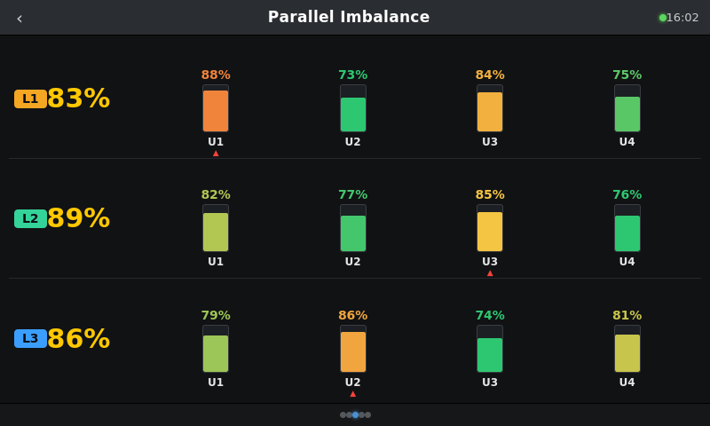

# Native GX Touch view (experimental)

`PageCurrentlyAmpedImbalance.qml` renders the parallel-imbalance view **directly on the
GX Touch / HDMI screen** as a native Venus OS GUI page — per-phase balance, per-unit load
heat bars, the hardest-unit flag, and a loose-connection voltage alert. It reads values
straight off D-Bus, so it does **not** depend on the Node-RED flow being present.

This is a separate, optional add-on to the FlowFuse web dashboard. Same idea, different
face: the web dashboard is Vue/HTML; this is QML reading dbus.

---

## ⚠️ READ THIS FIRST — caution

**Editing the Venus OS GUI is unsupported by Victron and does not survive firmware updates.**

- Files under `/opt/victronenergy/gui/` live on the root filesystem and are **replaced on
  every Venus OS update** — a hand-installed page silently disappears.
- **Deploy only via [SetupHelper](https://github.com/kwindrem/SetupHelper)** so it
  re-applies automatically after updates. Do not hand-edit `/opt` on a client system.
- **Test on a bench GX first.** A bad GUI edit can leave the touch screen blank/unusable
  until you SSH back in — not something to debug on a live client site.
- **gui-v1 only.** This page targets the classic QML GUI. It will **not** carry across to
  **gui-v2** unchanged; confirm which GUI your unit runs before deploying.
- Requires **root access** (enabled per device), which is itself a support/security
  consideration on client systems.

For anything client-facing, the reliable route remains the **web dashboard on a networked
wall tablet** — nothing on the GX to be wiped. Treat this QML page as a demo / teaching /
own-system piece.

---

## Configure

Set these at the top of the QML (`property` block) to match the system:

| Property | Meaning |
|----------|---------|
| `vebusService` | dbus service, usually `com.victronenergy.vebus` |
| `unitCount` | total inverter units |
| `phaseCount` | 1 or 3 |
| `ratedPerUnit` | W per unit (the bar 100% reference) |
| `spreadFullRatio` | phase spread treated as "fully severe" (0.25 = 25%) |
| `unitVwarn` / `unitVcrit` | per-unit voltage-deviation thresholds (V) |

## Data it reads (dbus)

- `com.victronenergy.vebus/Devices/<n>/Ac/Out/P` — per-unit output power
- `com.victronenergy.vebus/Devices/<n>/Ac/Out/V` — per-unit output voltage (if published)

Phase is inferred from Victron's interleaved device ordering (L1 = 0,3,6…; L2 = 1,4,7…;
L3 = 2,5,8…). The balance/heat/rating maths runs in the page's QML JavaScript.

## Install (bench, via SetupHelper — outline)

1. Enable **root access** on the GX (Settings → General) and SSH in.
2. Package this page with **SetupHelper** (a `FileSets`/`setup` script that copies the QML
   into the gui and adds a menu entry to `PageMain.qml`), so it re-applies after updates.
3. Add an `MbSubMenu`/entry in `PageMain.qml` that opens
   `PageCurrentlyAmpedImbalance.qml`.
4. Restart the GUI (`svc -t /service/gui`) and check the new page on the touch screen.
5. Verify it survives a firmware update (SetupHelper re-runs) before any field use.

> This QML is a **starting point** to refine on the bench against your Venus OS version —
> component names and the menu-wiring differ slightly between releases. Keep a backup of any
> file you touch, and never do this first on a live system.

---

Currently Amped (Harare). Native-display re-implementation of the original
*parallel imbalance* monitoring idea.
