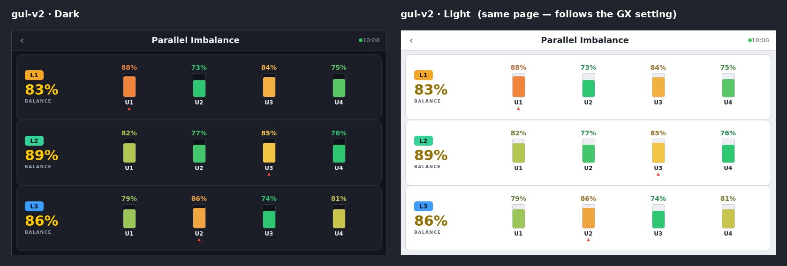

# Native GX Touch view — Venus OS gui-v2 (experimental)

`PageParallelImbalance.qml` renders the imbalance view **natively on the GX Touch / HDMI
screen** under **Venus OS gui-v2** — per-phase balance, per-unit load heat bars, the
hardest-unit flag, and a per-unit output-voltage / loose-connection check. It reads values
straight off the VE.Bus service via `VeQuickItem`, so it does **not** depend on the Node-RED
flow.

**It follows the GX's own Light / Dark setting automatically**, because it's built from
`Theme.color_*` tokens (gui-v2's `Dark.json` / `Light.json`) rather than hardcoded colours.

---

## ⚠️ READ THIS FIRST — caution

**Modifying the Venus OS GUI is unsupported by Victron and does not survive firmware updates.**
gui-v2 is also different from gui-v1 in a way that matters here:

- **gui-v2 is a *built* application** ([victronenergy/gui-v2](https://github.com/victronenergy/gui-v2)),
  not loose editable `.qml` files under `/opt`. You can't just drop this file onto a GX and
  have it appear. It is added by **building gui-v2 from source** with this page included, or
  through an emerging **gui-v2 mod tool** (e.g. a gui-v2 mod manager / SetupHelper package).
- **Firmware updates replace it.** Use a SetupHelper-style package so it re-applies, and expect
  to re-check it after major Venus OS updates — gui-v2's component API is still moving.
- **Test on a bench GX first.** Never debug a GUI change on a live client system.
- This file **follows gui-v2 conventions** (observed from the current source — `VeQuickItem`
  data, `Theme.color_*`, `Page` / `GradientListView` / `Label`, `Global.system.veBus.serviceUid`)
  but it has **not been compiled against a specific gui-v2 build** — treat it as a correct-shaped
  **starting point** to build and refine in your gui-v2 checkout.

For anything client-facing, the **web dashboard** remains the reliable route (works on gui-v1
*and* gui-v2, nothing on the GX to be wiped).

---

## How it's wired to gui-v2

| Concern | gui-v2 mechanism used |
|---------|-----------------------|
| Data | `VeQuickItem { uid: <vebus>/Devices/<n>/Ac/Out/P }` and `.../Ac/Out/V` |
| Service discovery | `Global.system.veBus.serviceUid` (override `bindPrefix` to pin one) |
| Theming (light/dark) | `Theme.color_*` tokens — follows the GX setting automatically |
| Status colours | `Theme.color_ok` / `Theme.color_warning` / `Theme.color_critical` |
| Layout | `Page` + `GradientListView` + `Label` (from `Victron.VenusOS`) |

Phase is inferred from Victron's interleaved device ordering (L1 = 0,3,6…; L2 = 1,4,7…;
L3 = 2,5,8…). Balance, heat scaling and the voltage-deviation check run in the page's JS.

## Configure

Set at the top of the QML: `unitCount`, `phaseCount`, `ratedPerUnit`, `spreadFullRatio`,
`unitVwarn` / `unitVcrit`. `bindPrefix` defaults to the auto-discovered VE.Bus service.

## Build / install (outline)

1. Clone [victronenergy/gui-v2](https://github.com/victronenergy/gui-v2) and get its demo/build
   running (there's a Qt desktop build for development — iterate there first).
2. Add `PageParallelImbalance.qml` to the project (e.g. under `pages/`), and register it so it's
   reachable — as a device-list entry / a page opened from the menu, following how an existing
   `pages/...` page is registered in the nav.
3. Build and run in the gui-v2 **demo mode** on desktop to check it compiles and reads the mock
   data, then against a real system.
4. Package the change with a SetupHelper-style gui-v2 package so it re-applies after firmware
   updates; deploy to a **bench GX** before any field use.

> Because gui-v2 is actively developed, confirm the component/theme token names against the
> version you're building — a couple may be renamed between releases.
